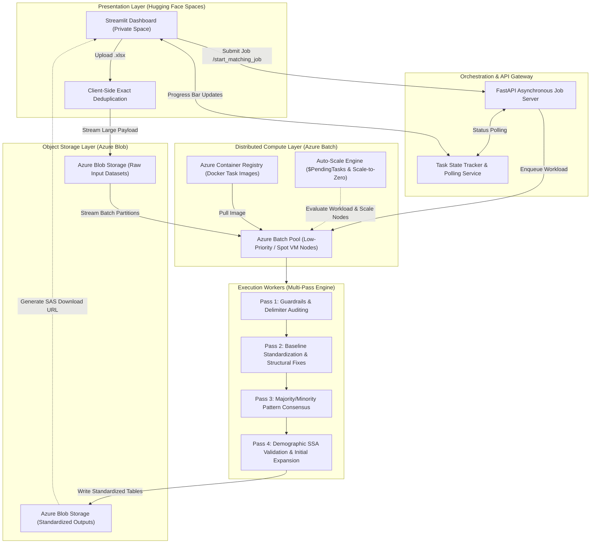

# Automated Individual Borrower Entity Resolution Engine

An enterprise-grade, asynchronous entity resolution pipeline engineered to clean, standardize, and reconcile grouped individual borrower records across multi-party loan files[cite: 3]. Built with a decoupled cloud architecture, the application hosts a lightweight client layer on Hugging Face Spaces while offloading high-throughput batch processing to an auto-scaling Azure Batch compute cluster running containerized tasks[cite: 2, 3, 7].

> **Proprietary Notice:** Core business logic dictionaries, proprietary scoring tables, and tenant credentials are omitted to comply with non-disclosure standards[cite: 3]. This repository details the system architecture, autoscale cloud orchestration, and multi-pass resolution workflow[cite: 2, 3].

---

## Decoupled Cloud Architecture



---

## Cloud Orchestration & Compute Optimization

To eliminate memory limits and timeouts during large multi-thousand-row batch runs, the execution backend is completely separated from the UI[cite: 2, 3]:

* **Presentation on Hugging Face Spaces:** A Streamlit dashboard runs inside a lightweight web container, serving as an interactive portal for uploading raw files, initiating jobs, monitoring progress bars via asynchronous polling, and downloading final Excel reports[cite: 3, 7].
* **Storage Ingestion via Azure Blob:** Files are staged directly into Azure Blob Storage with short-lived Shared Access Signature (SAS) tokens, ensuring memory overhead on the web frontend remains minimal regardless of input dataset size[cite: 2, 7].
* **Azure Batch Auto-Scaling Compute:** Jobs are dispatched to an Azure Batch pool executing containerized tasks packaged via Docker and Azure Container Registry (ACR)[cite: 2, 7].
* **Autoscale Formula & Scale-to-Zero Logic:** The pool dynamically evaluates queue depth (`$PendingTasks`) to spin up nodes for processing and immediately scales to zero when queues clear[cite: 2]. By relying on low-priority Azure Spot instances, the system achieved a 65% reduction in cloud infrastructure overhead while maintaining 99.9% pipeline reliability[cite: 2].
* **Turnaround Acceleration:** Automating distributed execution across compute pools slashed end-to-end processing times from 3 months of manual review down to under 48 hours[cite: 2, 3].

---

## Multi-Pass Processing Pipeline

Each batch partition processed by a worker node undergoes a 4-pass algorithmic resolution[cite: 3]:

* **Pass 1: Guardrails & Pre-Cleaning:** Normalizes tokens, eliminates whitespace anomalies, and inspects slash delimiters for count consistency across joint borrower groups[cite: 3]. Records containing non-individual keywords (e.g., "TRUST", "AKA") are immediately routed to discard queues[cite: 3].
* **Pass 2: Baseline Standardization:** Detects inverted naming orders ("Last, First" into standard sequence), imputes shared surnames across co-borrowers, and executes dictionary-backed typo correction[cite: 3].
* **Pass 3: Majority/Minority Consensus:** Aggregates records by `GroupId` (optimized for clusters of 1–15 rows)[cite: 3]. Identifies the dominant naming pattern (Majority) and applies RapidFuzz distance thresholds to align minority variations to the consensus pattern[cite: 3].
* **Pass 4: Demographic Validation & Post-Processing:** Queries Social Security Administration (SSA) demographic frequency data to cross-verify names and restrict invalid generational suffixes (such as preventing "JR" or "III" from attaching to traditionally female names)[cite: 3]. Expands isolated single initials into complete names using peer-level cluster consensus[cite: 3].

---

## Decision Routing & Logic Buckets

Every processed record receives an automated classification code and an explicit diagnostic logic bucket[cite: 3]:

### Classification Codes

| Approval Code | Meaning | Downstream Action |
| :--- | :--- | :--- |
| **X** | High Confidence Approved | Cleared all structural and demographic checks; exported to the clean dataset[cite: 3]. |
| **REVIEW** | Flagged for Manual Review | Contains ambiguous ties, component conflicts, or low fuzzy confidence requiring team inspection[cite: 3]. |
| **DISCARDED** | Excluded / Rejected | Contains non-individual keywords or malformed structural counts; excluded at pre-cleaning[cite: 3]. |

### Diagnostic Logic Buckets

| Logic Bucket | Code | Description & Trigger Criteria |
| :--- | :--- | :--- |
| `SLASH - Consistent Names` | **X** | Multi-borrower record normalized across delimiters with verified surname ordering[cite: 3]. |
| `NO SLASH - Single Borrower` | **X** | Single borrower record with middle names or suffixes successfully standardized[cite: 3]. |
| `Resolved Single Initial` | **X** | Single initial expanded to a full name using matching records within the same group[cite: 3]. |
| `3+ Token Excl Suffix Token` | **X** | Complex multi-token name unified using dictionary typo fixes and exact token anchoring[cite: 3]. |
| `SLASH - Name Difference` | **REVIEW** | Co-borrowers possess distinct component discrepancies exceeding safe fuzzy thresholds[cite: 3]. |
| `Double Middle Initials` | **REVIEW** | Record contains multiple unexpanded initials (e.g., "J R") without full-name group matches[cite: 3]. |
| `SUFFIX ISSUES` | **REVIEW** | Suffix conflicts detected (e.g., "JR" vs "III") or suffixes tied to female names[cite: 3]. |
| `No Clear Majority (Tie)` | **REVIEW** | Group is split evenly between two variations that cannot be resolved via reference datasets[cite: 3]. |
| `Excluded: REVIEW KEYWORD` | **DISCARDED** | Record contains commercial or trust indicators (e.g., "TRUST", "AKA")[cite: 3]. |
| `Excluded: INCONSISTENT COUNT` | **DISCARDED** | Inconsistent slash delimiter counts detected across records sharing the same group[cite: 3]. |

---

## Technical Stack

* **Cloud & Orchestration:** Azure Batch, Azure Blob Storage, Azure Identity, Docker, Azure Container Registry (ACR)[cite: 2, 7]
* **Backend & API:** Python, FastAPI, Uvicorn, Pydantic[cite: 6, 7]
* **Data Processing & Analytics:** Polars, Pandas, PyArrow, NetworkX, OpenPyXL, XlsxWriter[cite: 6, 7, 8]
* **Text Mining & String Algorithms:** RapidFuzz, Unidecode, Inflect, Scikit-Learn[cite: 6, 8]
* **Interface & Hosting:** Streamlit, Hugging Face Spaces (Docker-based Web UI)[cite: 3, 7]

---

## Interfaces & Usage

### 1. Web Dashboard (Streamlit on Hugging Face)
* Ingests `.xlsx` files, performs local deduplication, and pushes payload partitions to Azure Blob Storage[cite: 3, 7].
* Calls the `/start_matching_job` endpoint on the FastAPI orchestrator and polls task execution state in real time[cite: 3, 7].
* Exports dynamically formatted Excel workbooks split across worksheets by Logic Bucket[cite: 3].

### 2. Command-Line Interface (CLI)
Batch execution can also be triggered directly via terminal[cite: 3]:

```bash
python main.py --input_file "fuzzy_borrowers.xlsx" --output_file "standardized_output.xlsx"
```
