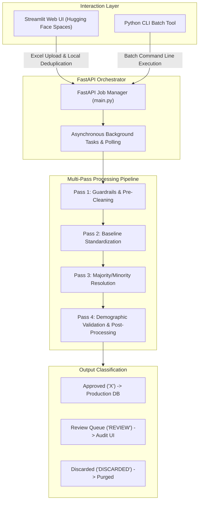

# Automated Individual Borrower Entity Resolution Engine

An enterprise-grade, asynchronous data pipeline that cleans, standardizes, and resolves discrepancies across grouped individual borrower records[cite: 3]. Built to replace manual, high-latency spreadsheet auditing, the system applies structural grammar rules, external demographic database validation, and fuzzy pattern matching to deliver high-confidence standardized records while isolating ambiguous edge cases for human review[cite: 3].

> **Proprietary Notice:** Core business logic, proprietary name dictionaries, and internal database records have been omitted to comply with non-disclosure standards[cite: 3]. This repository demonstrates the end-to-end architecture, multi-pass resolution stages, and algorithmic workflow[cite: 3].

---

## System Architecture



---

## Pipeline Execution Stages

* **Pass 1: Guardrails & Pre-Cleaning:** Strips whitespace anomalies and duplicate adjacent tokens[cite: 3]. Scans borrower counts separated by slashes to confirm structural consistency across multi-borrower records[cite: 3]. Immediately filters out non-individual records containing entity markers such as "TRUST" or "AKA"[cite: 3].
* **Pass 2: Baseline Standardization:** Inverts flipped name order (e.g., converting "Last, First" into standard order)[cite: 3]. Infers shared surnames across co-borrowers where secondary borrowers lack an explicit last name[cite: 3]. Corrects minor spelling anomalies using dictionary-backed verification[cite: 3].
* **Pass 3: Majority/Minority Cluster Resolution:** Aggregates records by unique entity identifier (`GroupId`), handling clusters between 1 and 15 records[cite: 3]. Identifies the dominant naming pattern (Majority) across the cluster[cite: 3]. Leverages RapidFuzz token distance to align minority variations to the consensus pattern when scores clear strict safety thresholds[cite: 3].
* **Pass 4: Modular Post-Processing & Demographic Validation:** Queries Social Security Administration (SSA) demographic frequency data to cross-verify names and prevent invalid generational suffixes (such as ensuring "JR" or "III" are not incorrectly attributed to female names)[cite: 3]. Resolves and expands isolated single initials into full first or middle names using intra-cluster consensus[cite: 3].

---

## Decision Routing & Output Buckets

Every processed record receives an automated classification code and an explicit diagnostic reason code explaining the routing decision[cite: 3]:

### Classification Codes

| Approval Code | Status | Pipeline Action |
| :--- | :--- | :--- |
| **X** | High Confidence Approved | Cleared all structural, demographic, and fuzzy thresholds; routed directly to the clean export dataset[cite: 3]. |
| **REVIEW** | Flagged for Manual Review | Contains ambiguous ties, component conflicts, or low fuzzy scores requiring human inspection[cite: 3]. |
| **DISCARDED** | Excluded / Rejected | Contains non-individual keywords or malformed structural counts; rejected at pre-cleaning[cite: 3]. |

### Diagnostic Logic Buckets

| Logic Bucket | Code | Description & Trigger Criteria |
| :--- | :--- | :--- |
| `SLASH - Consistent Names` | **X** | Multi-borrower record normalized across delimiters with verified surname ordering[cite: 3]. |
| `NO SLASH - Single Borrower` | **X** | Single-individual borrower record with middle names or suffixes successfully standardized[cite: 3]. |
| `Resolved Single Initial` | **X** | Single initial expanded to a full name using matching records within the same group[cite: 3]. |
| `3+ Token Excl Suffix Token` | **X** | Complex multi-token name unified using dictionary typo fixes and exact token anchoring[cite: 3]. |
| `SLASH - Name Difference` | **REVIEW** | Co-borrowers possess distinct component discrepancies exceeding safe fuzzy thresholds[cite: 3]. |
| `Double Middle Initials` | **REVIEW** | Record contains multiple unexpanded initials (e.g., "J R") without full-name group matches[cite: 3]. |
| `SUFFIX ISSUES` | **REVIEW** | Suffix conflicts detected (e.g., "JR" vs "III") or suffixes tied to female names[cite: 3]. |
| `No Clear Majority (Tie)` | **REVIEW** | Group is split evenly between two variations that cannot be resolved via reference datasets[cite: 3]. |
| `Excluded: REVIEW KEYWORD` | **DISCARDED** | Record contains commercial or trust indicators (e.g., "TRUST", "AKA")[cite: 3]. |
| `Excluded: INCONSISTENT COUNT` | **DISCARDED** | Inconsistent slash delimiter counts detected across records sharing the same group[cite: 3]. |

---

## Technical Stack

* **Backend & API:** Python, FastAPI, Uvicorn, Pydantic[cite: 3, 6]
* **Data Processing & Analytics:** Polars, Pandas, PyArrow, NetworkX, OpenPyXL, XlsxWriter[cite: 3, 6, 8]
* **String Matching & NLP:** RapidFuzz, Unidecode, Inflect, Scikit-Learn[cite: 3, 6, 8]
* **User Interface & Hosting:** Streamlit, Hugging Face Spaces (Docker deployment)[cite: 3, 6, 7]

---

## Usage

### 1. Web Dashboard (Streamlit)
* Ingests `.xlsx` files and performs exact-match deduplication locally prior to API submission[cite: 3].
* Submits jobs to `/start_matching_job` on the FastAPI server and displays asynchronous progress updates[cite: 3].
* Exports standardized Excel workbooks categorized into distinct tabs by Logic Bucket[cite: 3].

### 2. Command-Line Interface (CLI)
Batch execution can be triggered via terminal:

```bash
python main.py --input_file "fuzzy_borrowers.xlsx" --output_file "standardized_output.xlsx"
```
